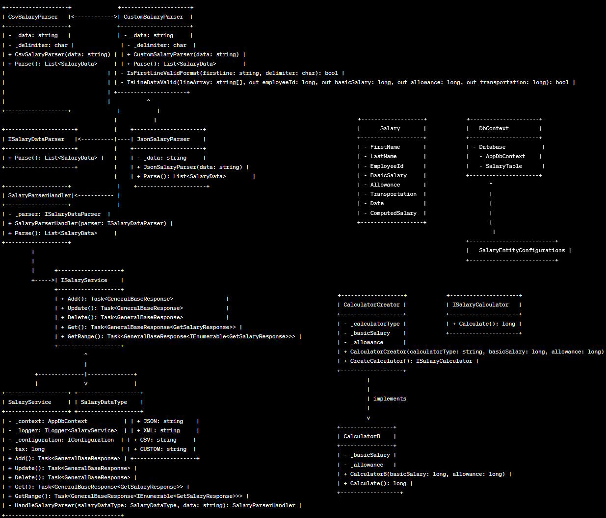

# Salary API

This API provides functionalities to manage salary records for employees. It allows you to add, update, retrieve, get a range of salary records, and delete records for a specific employee within a specified time period.

## Table of Contents

- [Getting Started](#getting-started)

- [Endpoints](#endpoints)

- [Add Salary Record](#add-salary-record)

- [Update Salary Record](#update-salary-record)

- [Get Salary Record](#get-salary-record)

- [Get Salary Records in a Range](#get-salary-records-in-a-range)

- [Delete Salary Record](#delete-salary-record)

- [Error Handling](#error-handling)

- [Contributing](#contributing)

## Getting Started

### Prerequisites

- .NET SDK

- Visual Studio or any code editor of your choice

### Installation

1. Clone the repository:

```bash

git clone https://github.com/smjebelli/SalaryApi.git

cd SalaryApi
docker build -t SalaryApi
docker run -p 8080:80 -p 4430:443 SalaryApi

```

### 1. Add Salary Record

- **Method:** `POST`

- **Endpoint:** `/{datatype}/salary/add`

- **Request Body:**

- `datatype` (path parameter): Type of data format ('Csv','XMl', 'JSON', 'Custom')

- `Data` (form parameter): Salary data file ( Excel, CSV,Custom.dat,data.xml)
  custom:
  EmployeeId/FirstName/LastName/BasicSalary/Allowance/Transportation/Date
  101/Ali/Ahmadi/1200000/400000/350000/14010901
  101/Ali/Ahmadi/1200000/400000/350000/14011001
  101/Ali/Ahmadi/1200000/400000/350000/14020601
  CSV:
  101,Ali,Ahmadi,1200000,400000,350000,14010901
  101,Ali,Ahmadi,1200000,400000,350000,14011001
  101,Ali,Ahmadi,1200000,400000,350000,14020601
  Json:
  [{
  "FirstName": "Ali",
  "LastName": "Ahmadi",
  "EmployeeId": 100,
  "BasicSalary": 12000000,
  "Allowance": 400000,
  "Transportatoin": 350000,
  "Date": "14020801"
  }]

- `OverTimeCaluculator` (form parameter): Over-time calculator function name ("A","B","C")

- **Example Request:**

```http
curl --location 'http://localhost:5204/csv/Salary/Add' \
--header 'accept: */*' \
--form 'Data=@"/C:/Code/Practice/SalaryApi/SalaryApi/SalaryApi/SampleData/Salary.csv"' \
--form 'OverTimeCaluculator="B"'
```

**Response:**

- Success: `200 OK` with relevant data
- Failure: `400 Bad Request` with error message

### 2. Update Salary Record

- **Method:** `POST`

- **Endpoint:** `/Salary/Update`

- **Request Body:**

- `body parameter:`

```json
{
  "employeeId": 100,
  "firstName": "string",
  "lastName": "string",
  "basicSalary": 1000000,
  "allowance": 100,
  "transportation": 150,
  "date": "14010801",
  "overTimeCaluculator": "B"
}
```

- **Response:**

- Success: `200 OK` with relevant data
- Failure: `400 Bad Request` with error message

### 3. Delete Salary Record

- **Method:** `Delete`

- **Endpoint:** `/Salary/Delete`

- **Request Body:**

- `body parameter:`

```json
{
  "employeeId": 100,
  "date": "14010801"
}
```

- **Response:**

- Success: `200 OK` with relevant data
- Failure: `400 Bad Request` with error message

### 4. Get Salary Record

- **Method:** `Get`

- **Endpoint:** `/Salary/Get`

- **Request Body:**
- `EmployeeId (Query parameter)`
- `Date(Query parameter)`

- **Response:**

- Success: `200 OK` with relevant data
- Failure: `400 Bad Request` with error message

###

### 4. GetRange of Salary Record

- **Method:** `GetRange`

- **Endpoint:** `/Salary/Get`

- **Request Body:**
- `EmployeeId (Query parameter)`

- **Response:**

- Success: `200 OK` with relevant data
- Failure: `400 Bad Request` with error message

## License

This project is licensed under the [MIT License]

### UML Diagram


